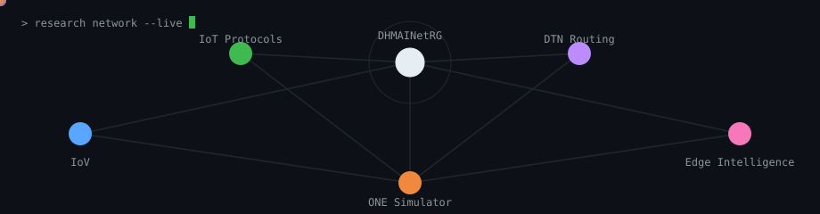

<div align="center">
  
</div>

<h1 align="center">Md. Ashik-Uz-Zaman</h1>

<div align="center">
  
</div>

<div align="center">
  <a href="https://github.com/ashikonik"></a>
  <a href="https://www.linkedin.com/in/ashikonik"></a>
  <a href="https://scholar.google.com/citations?user=6up31n8AAAAJ&hl=en"></a>
  <a href="https://orcid.org/0009-0008-1047-4361"></a>
  <a href="mailto:ashikonik052@gmail.com"></a>
</div>

<div align="center">
  
</div>

```text
$ cat profile.txt

Md. Ashik-Uz-Zaman
------------------
Location : Dhaka, Bangladesh
Focus    : IoV · IoT protocols · network simulation
Group    : Research Assistant @ DHMAINetRG
Papers   : 4 (3 published, 1 accepted)
Open to  : Research collaborations & software projects
```

## §1 · About

I'm a Computer Science student at East West University in Dhaka and a research
assistant at the DHMAINetRG group, where I work on computer networks and IoT
protocols. Most of my research uses the ONE Simulator to study how
Internet-of-Vehicles traffic behaves on the real road network of Dhaka, which
has so far produced a few IEEE conference papers. Alongside research, I build
small software projects — from a patient-record platform to a metro ticketing
CLI in C.

I'm still early in my research journey, and I learn something new on every
project. A cat sleeps on whatever paper I'm currently annotating; the
annotations still happen, eventually. Happy to talk about networking,
simulation, or software.

## §2 · Research Interests

 **Internet-of-Vehicles (IoV)** — urban mobility and DTN routing, validated
against Dhaka's actual road network. *See [2], [3].*

 **IoT protocols** — context-aware, partially reliable application-layer
delivery with edge intelligence. *See [1].*

 **Network simulation** — reproducible experiments in the ONE Simulator,
the shared methodology behind the IoV work above.

## §3 · Publications

- **[1]** PRIoTP: Towards Context-Aware Partial Reliable Application-Layer IoT Protocol
  with Edge Intelligence — ISIoT 2026 · `Accepted`
- **[2]** Integration and Validation of Map Data in the ONE Simulator: IoV in Dhaka City
  Perspective — ICCIT 2025, IEEE ·
  [DOI: 10.1109/ICCIT68739.2025.11491083](https://doi.org/10.1109/ICCIT68739.2025.11491083) · `Published`
- **[3]** The Impact of Pedestrian Movement on IoV Performance and Simulation —
  ICCIT 2025, IEEE ·
  [DOI: 10.1109/ICCIT68739.2025.11491296](https://doi.org/10.1109/ICCIT68739.2025.11491296) · `Published`
- **[4]** Design and Implementation of a GPT for Universities of Bangladesh, 2026 —
  QPAIN, IEEE ·
  [DOI: 10.1109/QPAIN69676.2026.11545594](https://doi.org/10.1109/QPAIN69676.2026.11545594) · `Published`

## §4 · Projects

| Project | Area | Stack | Year |
|---|---|---|---|
| IoV Simulation of Dhaka City¹ | research | ONE Simulator, Java, OpenStreetMap, DTN Routing | 2025 |
| PRIoTP: Partial-Reliable IoT Protocol² | research | IoT, Network Protocols, Edge Computing | 2026 |
| [MediCare](https://github.com/ashikonik/MediCare)³ · [demo](https://medi-care-orpin-phi.vercel.app) | software | TypeScript, Next.js, Prisma, PostgreSQL, OCR | 2026 |
| [Laptop RAG Recommender](https://github.com/ashikonik/cse488-laptop-rag) `in progress` | software | Python, FastAPI, FAISS, Spark, Sentence-Transformers | 2026 |
| [Metro Rail Ticketing System](https://github.com/ashikonik/Metro-Rail-Ticketing-System) | software | C, CLI Design | 2024 |
| Library Management System⁴ | software | Java, JavaFX, OOP, File Persistence | 2024 |

<sub>¹ ² see Publications — ¹ refs [2], [3]; ² ref [1] · ³ designed under the working
names MediVault and CareNexus before this implementation · ⁴ coursework project, not
published as a public repository</sub>

## §5 · Skills

- **Programming Languages** — C, C++, Java, Python, JavaScript
- **Web & Database** — HTML, CSS, React, Express, MySQL
- **Research Tools** — ONE Simulator, LaTeX, Git & GitHub
- **Other** — VS Code, Adobe Photoshop, Academic Writing

## §6 · Activity


## §7 · Connect

Find me on [GitHub](https://github.com/ashikonik),
[LinkedIn](https://www.linkedin.com/in/ashikonik),
[Google Scholar](https://scholar.google.com/citations?user=6up31n8AAAAJ&hl=en),
and [ORCID](https://orcid.org/0009-0008-1047-4361), or email me at
[ashikonik052@gmail.com](mailto:ashikonik052@gmail.com).

<div align="center">
  
</div>

## Colophon

No frameworks, no trackers, no build step — just markdown, SVG, and a dozing
cat. Thanks for reading this far.
